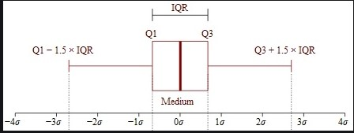
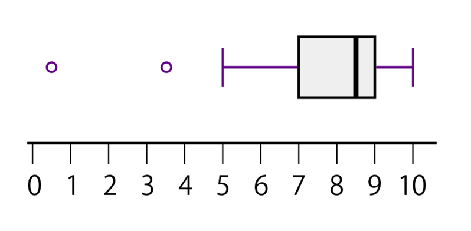

## 什么是 Inliers 和 Outliers？

Outliers（异常值）是看起来与给定数据集中的大多数其他值有很大差异的值。异常值通常可能是由于新发明（真正的异常值）、新模式/现象的发展、实验错误、很少发生的事件、异常、由于排版错误导致的错误输入数据、数据记录系统/组件故障等而出现的。
Inliers（正常值）是除异常值之外的分布中的所有数据点。

## 异常值的识别

*全局或点异常值*： 偏离分布的单个值/数据点，大多数异常值检测方法通常旨在检测点/全局异常值。

*集合异常值*：当一组数据点偏离分布时，称为集合异常值。根据特定领域来解释它们的相关性是完全主观的。此外，集合异常值表明新现象或发展的形成。

*上下文异常值*：这些是基于对其相关性的解释的特定条件，例如语音识别技术中的单一背景噪声。

## 识别方法

### 四分位间距(IQR)

四分位距 (IQR) 是一种衡量变异性的方法，它通过将数据集划分为四分位数来实现。四分位数将一个按等级排序的数据集划分为四个相等的部分。

盒须图使用四分位数（将数据划分为大小相等的四组点）来绘制数据的形状。盒子代表第 1 个和第 3 个四分位数，它们等于第 25 个和第 75 个百分点。盒子内的线代表第二个四分位数，即中间值。

四分位距是第一个和第三个四分位数（盒子边缘）之间的间距。Tukey 认为，如果数据点比第一个四分位数低 1.5 乘 IQR，或比第三个四分位数高 1.5 乘 IQR，就属于离群或极度离群。在经典的盒须图中，须线一直延伸到界限内的最后一个数据点。

*IQR 定义为 Q3–Q1，位于 Q3+1.5*IQR 或 Q1-1.5*IQR 之外的数据被视为离群值。*

### 箱形图
>
> 箱形图（英文：box plot），又称为盒须图、盒式图、盒状图或箱线图

这组数据显示出：

下边界=5 \
第1四分位数（Q1）=7 \
中位数、第2四分位数（median、Q2）=8.5 \
第3四分位数（Q3）=9 \
上边界=10 \
四分位间距（即ΔQ）= (Q3−Q1)=2

数值位于范围外1.5×IQR到3×IQR范围的数值，称作适度离群值。
数值位于范围外3×IQR以上的数值，称作极端离群值。
因此该图中的离群值有： \
适度离群值 = 3.5 \
极端离群值 = 0.5

### 参考文章

[使用 IQR、Z 分数、LOF 和 DBSCAN 检测异常值](https://www.kuxai.com/article/622)

[IQR（Interquartile Range，四分位距）](https://docs.oracle.com/cloud/help/zh_CN/pbcs_common/PFUSU/insights_metrics_IQR.htm#PFUSU-GUID-CF37CAEA-730B-4346-801E-64612719FF6B)

[箱型图](https://zh.wikipedia.orghttps://zh.wikipedia.org/wiki/%E7%AE%B1%E5%BD%A2%E5%9C%96)
