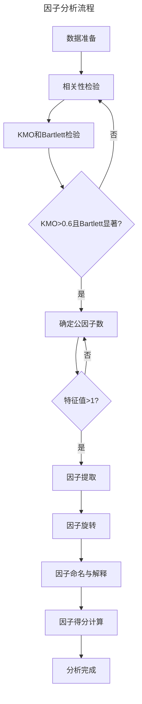

## 属性降维

属性降维是指在保持数据集信息完整性的前提下，通过消除冗余、噪声或不相关的属性，减少属性个数，提高数据集的处理效率和学习性能。简单说就是降维。

目前已经存在大量的数据降维算法，可以从另个不同的维度对它们进行分类。按照是否有使用样本的标签值，可以将降维算法分为 有监督降维 和 无监督降维 ；按照降维算法使用的映射函数，可以将算法分为 线性降维 与 非线性降维 。

### 分类

有监督降维是指在降维过程中使用了样本的标签值。有监督降维的目标是在降维的同时，保持样本的类别信息。有监督降维的代表算法是线性判别分析（LDA）。

无监督降维是指在降维过程中没有使用样本的标签值。无监督降维的目标是在降维的同时，保持数据集的内在结构。无监督降维的代表算法是主成分分析（PCA）。

### PCA主成分分析

PCA的思想是将n维特征映射到k维上（k < n），这k维是全新的正交特征。这k维特征称为主成分，是重新构造出来的k维特征，而不是简单地从n维特征中去除其余n-k维特征。

### ICA独立成分分析

与主成分分析区别：主成分分析假设源信号间彼此非相关，独立成分分析假设源信号间彼此独立。主成分分析认为主元之间彼此正交，样本呈高斯分布；独立成分分析则不要求样本呈高斯分布。

### LDA线性判别分析

| 降维方法 | 思想          | 分布         | 监督方式 | 投影                           | 维度                                    | 目的                                  |
| ---- | ----------- | ---------- | ---- | ---------------------------- | ------------------------------------- | ----------------------------------- |
| PCA  | 数据降维，矩阵特征分解 | 假设数据符合高斯分布 | 无监督  | 投影的坐标系都是正交的                  | 直接和特征维度相关，比如原始数据是d维，PCA之后，可以任意选取1～n维  | 去除原始数据集中冗余的维度，让投影子空间各个维度的方差尽可能大     |
| LDA  | 数据降维，矩阵特征分解 | 假设数据符合高斯分布 | 有监督  | 根据类别的标注关注分类能力，不保证投影到的坐标系是正交的 | 与数据本身的维度无关，和类别个数C相关，LDA之后，在1～C-1维进行选择 | 找到具有区分的维度，使得原始数据在这些维度上的投影能尽可能区分不同类别 |

## 特征选择

三种方法：过滤法（filter）、包装法（wrapper）和嵌入法（embedded）

### 过滤法

#### 方差过滤

一个特征本身的方差很小，就表示样本在这个特征上基本没有差异，可能特征中的大多数值都一样，甚至整个特征的取值都相同，那这个特征对于样本区分没有什么作用，设置阈值来控制小于阈值方差的特征被删除。

#### 相关性过滤

在 sklearn 中有三种常用的方法来评判特征和标签之间的相关性：卡方、F检验和互信息。

##### 卡方过滤

卡方过滤是专门针对离散型标签的相关性过滤。  
卡方检验类feature_selection.chi2计算每个非负特征和标签之间的卡方统计量，并依照卡方统计量由高到低为特征排名
> 卡方统计量是用于检验观察值与期望值之间差异的统计量，常用于卡方检验。

##### F检验

F检验既可以做回归也可以做分类

##### 互信息

互信息法是用来捕捉每个特征与标签之间的任意关系（包括线性和非线性关系）。  \
F检验只能够找出线性关系，而互信息法可以找出任意关系。

互信息法不返回 p 值或 F 值类似的统计量，它返回“每个特征与目标之间的互信息量的估计”，这个估计量在[0,1]之间取值，为0则表示两个变量独立，为1则表示两个变量完全相关。

### Embedding嵌入法

嵌入法就是先使用某些机器学习的算法和模型进行训练，得到各个特征的权值系数，根据系数从大到小选择特征。这种方法是直接将特征选择过程嵌入到模型训练中，和模型训练同时进行。

### Wrapper包装法

包装法也是一个特征选择和算法训练同时进行的方法，与嵌入法十分相似，它也是依赖于算法自身的选择，比如coef_属性或feature_importances_属性来完成特征选择。但不同的是，我们往往使用一个目标函数作为黑盒来帮助我们选取特征，而不是自己输入某个评估指标或统计量的阈值。包装法在初始特征集上训练评估器，并且通过coef_属性或通过feature_importances_属性获得每个特征的重要性。然后，从当前的一组特征中修剪最不重要的特征。在修剪的集合上递归地重复该过程，直到最终到达所需数量的要选择的特征。区别于过滤法和嵌入法的一次训练解决所有问题，包装法要使用特征子集进行多次训练，因此它所需要的计算成本是最高的。

## 因子分析

因子分析就是将存在某些相关性的变量提炼为较少的几个因子，用这几个因子去表示原本的变量，也可以根据因子对变量进行分类。

举个例子。学生有语文、英语、历史、数学、物理、化学六门成绩，通过因子分析会发现这六门课由两个公共因子驱动，前三门是由“文科”因子，后三门是“理科”因子；从而可以计算每个学生的文科得分和理科得分来评估他在两个方面的表现。

### 理论

将每个观测变量用一组因子的线性组合表示

$$

x_i = L_iF + E_i = \sum_{j=1}^{m}L_{ij}F_j + E_i
= L_{i1}F_1 + L_{i2}F_2 + ... + L_{im}F_m + E_i

$$

$F_1,F_2,...,F_m$叫做公因子，它们是各个观测变量所共有的因子，解释了变量之间的相关性。

$E_1,E_2,...,E_n$叫做特殊因子，它们是各个观测变量特有的因子，解释了变量之间的独立性，相当于多元回归中的残差项，表示该变量不能被公因子所解释的部分。

$L_{ij}$是因子载荷(因子得分)，表示第$j$个因子对第$i$个变量的影响。

### 流程

首先的任务是求载荷矩阵，流程如下：

#### 标准化

对原始数据进行标准化处理，使得每个变量的均值为0，方差为1。

#### 计算相关系数矩阵

> [!info]
> 相关系数矩阵是一个对称矩阵，对角线上的元素是1，表示每个变量与自己的相关系数是1。
>
> 相关系数矩阵计算公式为：
>
> $Corr(X,Y) = \frac{Cov(X,Y)}{\sigma_{X}\sigma_{Y}}$
>
> 协方差矩阵是多个变量之间的协方差组成的矩阵
> 协方差矩阵计算公式为：
>
> $Cov(X,Y) =  \frac{1}{n-1} \sum_{i=1}^n (X_i - \bar{X})(Y_i - \bar{Y})$

计算标准化后的数据的相关系数矩阵。

#### 因子提取

其中，因子提取包括主成分法、最大似然法、最小残差法等。这里以主成分法为例。

> 特征值 λ 表示特征向量 v 在矩阵 A 作用下的缩放比例
> 特征向量指示了矩阵 A 的主要变化方向。

首先基于协方差矩阵的特征值分解。接着提取前k个最大的特征值对应的特征向量。

#### 计算载荷矩阵

载荷矩阵**L**是因子提取结果的直接输出,对于主成分法，载荷矩阵可以通过以下公式计算：

$$

L = \sqrt{D}V

$$

其中，$D$是特征值对角矩阵，$V$是特征向量矩阵。

#### 因子旋转(可选)

对载荷矩阵进行旋转（如方差最大化旋转，Varimax Rotation），使得因子更容易解释。

旋转后的载荷矩阵通常具有更清晰的模式（某些变量在某些因子上载荷较高，而在其他因子上载荷较低）。

----
接下来需要通过因子载荷降维数据

#### 因子得分计算

因子得分表示每个样本在潜在因子上的取值。

可以通过下面的公式计算：

$$

F = XL(L^TL)^{-1}

$$

> [!info]
> 这里在计算因子得分是巴特莱特（Bartlett）法
>
> 公式是在最小二乘意义下，对因子得分 ( F ) 进行估计的公式。这个公式假设因子之间是不相关的，并且每个观察变量与因子之间的关系可以用线性模型来描述。

因子得分矩阵F就是降维后的数据。

#### 完整流程

### 因子分析和属性降维方法的区别

> 因子分析解释相关性，也就是降维后的因子与降维前的属性之间有线性的关联

| 方法               | 目标              | 假设           | 优点              | 缺点                | 适用场景          |
| ---------------- | --------------- | ------------ | --------------- | ----------------- | ------------- |
| **因子分析 (FA)**    | 提取潜在因子，解释变量相关性  | 多元正态分布，误差独立  | 揭示潜在结构，适用于探索性分析 | 对分布假设强，解释可能主观     | 数据降维，社会科学，心理学 |
| **主成分分析 (PCA)**  | 最大化投影方差         | 无            | 计算简单，无需分布假设     | 主成分难以解释，对非线性关系不敏感 | 数据降维，可视化      |
| **独立成分分析 (ICA)** | 分离独立成分          | 非高斯分布        | 适用于盲源分离         | 对分布假设强，计算复杂       | 信号处理，脑电图分析    |
| **线性判别分析 (LDA)** | 最大化类间距离，最小化类内距离 | 多元正态分布，协方差相同 | 适用于有监督降维和分类     | 对分布假设强，不适用于非线性数据  | 分类问题，人脸识别     |

## 代码

{}

## 附录

- [机器学习算法—降维算法—PCA](https://jintang.github.io/2019/08/27/%E6%9C%BA%E5%99%A8%E5%AD%A6%E4%B9%A0%E7%AE%97%E6%B3%95%E2%80%94%E9%99%8D%E7%BB%B4%E7%AE%97%E6%B3%95%E2%80%94PCA/)
- [线性特征降维——ICA](https://leoncuhk.gitbooks.io/feature-engineering/content/feature-extracting04.html)

- [机器学习之特征选择](https://www.cnblogs.com/s1awwhy/p/14067489.html)
