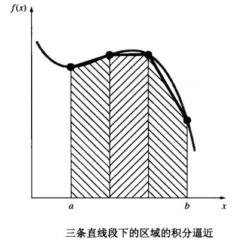
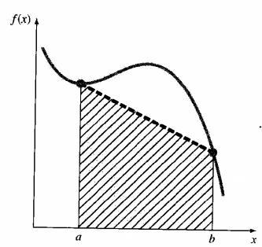
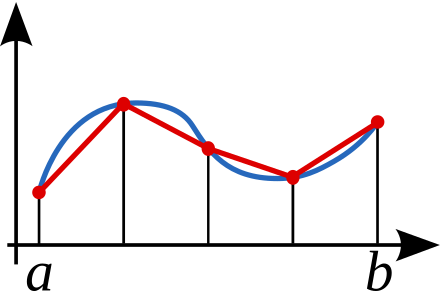

### 介绍

牛顿-柯特斯公式(Newton-Cotes formulas)是一种常用的数值积分公式。它的基本策略是用另一个易于积分的近似函数替换被积函数或表格型数据，即
$$
I=\int_{a}^{b} f(x) d x \cong \int_{a}^{b} f_{n}(x) d x
$$
其中，$f_n(x)$是具有如下形式的多项式
$$
f_{n}(x)=a_{0}+a_{1} x+\ldots+a_{n-1} x^{n-1}+a_{n} x^{n}
$$



牛顿-柯特斯公式分为闭型(closed forms)和开型(open forms)两类。在积分过程中，如果积分区间两端的数据点是已知的，则称为闭型积分，反之，若积分区间超出了数据范围，则称为开型积分 。

> [!important]  
> 本文仅介绍闭型积分。

### 梯形法则

梯形法则是牛顿-柯特斯公式的一种特殊情况，即$n=1$时的情况。在梯形法则中，$f_n(x)$是一个一次多项式，即
$$
f_{1}(x)=a_{0}+a_{1} x
$$
此时就是使用梯形（直线下的面积）来逼近积分区域。



这个区域的面积为：

$$
I = S=(b-a) \frac{f(a)-f(b)}{2}
$$

这就是**梯形法则**

### 多段区间的梯形公式使用



为了计算出更加准确的定积分，我们可以将区间$[a, b]$等分为$n$个小区间，每个小区间的长度（也就是梯形的高）为
$$h=(b-a)/n$$
则有
$$
\begin{aligned}
I = S &=\frac{h}{2}\left[f(a)+2 f\left(a+h\right)+2 f\left(a+2 h\right)+\ldots+2 f\left(a+(n-1) h\right)+f(b)\right] \\
&=\frac{h}{2}\left[f(a)+2 \sum_{i=1}^{n-1} f\left(a+i h\right)+f(b)\right]
\end{aligned}
$$

> [!important]
> 当区间的长度并不相同时，这一条公式便不能使用。

### Python多段区间求积分的实例

```python
import numpy as np
from scipy.integrate import quad
def f(x):
    return np.cos(2 * np.pi * x) * np.exp(-x) + 1.2
integral, error = quad(f, 0, 0.7)
print(f'积分的结果是：{integral}')
a = 0
b = 0.7
n = 1000
h = (b - a) / n
x = np.linspace(a, b, n + 1)
S = a + b
for i in range(1,n):
    S += 2 * f(a+i*h)
S *= h / 2
print(f'梯形法的结果是：{S}')
```

```python
积分的结果是：0.7951866427656943
梯形法的结果是：0.7942955196893673
```

### 附录

[牛顿科特斯公式](https://www.zywvvd.com/notes/study/math/trapezoid-rule/trapezoid-rule/#)
