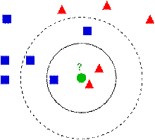

### 介绍

k近邻算法，也称为 KNN 或 k-NN，是一种非参数、有监督的学习分类器，KNN 使用邻近度对单个数据点的分组进行分类或预测。

### 基本思想

下图中有两种类型的样本数据，一类是蓝色的正方形，另一类是红色的三角形，中间那个绿色的圆形是待分类数据：

如果K=3，那么离绿色点最近的有2个红色的三角形和1个蓝色的正方形，这三个点进行投票，于是绿色的待分类点就属于红色的三角形。而如果K=5，那么离绿色点最近的有2个红色的三角形和3个蓝色的正方形，这五个点进行投票，于是绿色的待分类点就属于蓝色的正方形。

### 问题优化

#### 近邻间的距离会被大量的不相关属性所支配

应用k-近邻算法的一个实践问题是，实例间的距离是根据实例的所有属性（也就是包含实例的欧氏空间的所有坐标轴）计算的。这与那些只选择全部实例属性的一个子集的方法不同，例如决策树学习系统。
比如这样一个问题：每个实例由20个属性描述，但在这些属性中仅有2个与它的分类是有关。在这种情况下，这两个相关属性的值一致的实例可能在这个20维的实例空间中相距很远。结果，依赖这20个属性的相似性度量会误导k-近邻算法的分类。近邻间的距离会被大量的不相关属性所支配。这种由于存在很多不相关属性所导致的难题，有时被称为维度灾难（curse of dimensionality）。最近邻方法对这个问题特别敏感。 \
解决方法：当计算两个实例间的距离时对每个属性加权。
这相当于按比例缩放欧氏空间中的坐标轴，缩短对应于不太相关属性的坐标轴，拉长对应于更相关的属性的坐标轴。每个坐标轴应伸展的数量可以通过交叉验证的方法自动决定。

#### 如何建立高效的索引

因为这个算法推迟所有的处理，直到接收到一个新的查询，所以处理每个新查询可能需要大量的计算。 \
解决方法：目前已经开发了很多方法用来对存储的训练样例进行索引，以便在增加一定存储开销情况下更高效地确定最近邻。一种索引方法是kd-tree（Bentley 1975；Friedman et al. 1977），它把实例存储在树的叶结点内，邻近的实例存储在同一个或附近的结点内。通过测试新查询xq的选定属性，树的内部结点把查询xq排列到相关的叶结点。

### 附录

[使用KNN算法分析生活日常事件代码](code/使用KNN算法分析生活日常事件.ipynb) \
[KNN实战识别数字](code/KNN实战识别数字.ipynb)
