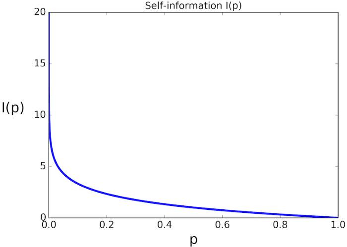
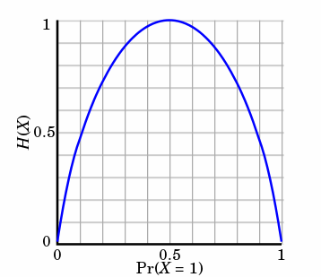

### 信息量函数

$$
I = h(x) = -log_2(p(x))
$$

其中, 对数函数底的选择是任意的，信息论中底常常选择为2 \
h(x)的单位为比特(bit) \
而机器学习中底常常选择为自然常数， \
h(x)的单位为奈特(nat)

### 信息熵

信息熵是接受信息量的平均值，用于确定信息的不确定程度，是随机变量的均值

$$
H(X) = -\sum_{i=1}^{n}p(x_i) * log_2(p(x_i))
$$

随机变量的取值个数越多，状态数也就越多，信息熵就越大，混乱程度就越大。当随机分布为均匀分布时，熵最大

⾮均匀分布⽐均匀分布的熵要⼩

当随机变量的取值为两个时，熵随概率的变化:

### 联合熵

$$
\begin{aligned}
    H(X,Y) &= -\sum_{x,y}p(x,y)log_2p(x,y) \\
    &= -\sum_{i=1}^n\sum_{j=1}^mp(x_i,y_i)log_2p(x_i,y_i)
\end{aligned}\tag{4}

$$

### 条件熵

在已知随机变量X的条件下随机变量Y的不确定性，记作H(Y|X)。H(Y|X)是X给定条件下Y的条件概率分布的熵对X的数学期望

$$
\begin{aligned}
    H(Y|X) &= \sum_x p(x) H(Y|X=x) \\
    &= -\sum_x p(x)\sum_y p(y|x)log_2p(y|x) \\
    &= -\sum_x \sum_y p(x,y)log_2p(y|x) \\
    &= -\sum_{x,y} p(x,y)log_2p(y|x)
\end{aligned} \tag{5}

$$

条件熵H(Y|X)也可以理解为联合熵H(X,Y)减去随机变量X的熵H(X)，即

$$
\begin{aligned}
    H(Y|X) &= H(X,Y) - H(X) \\
    &= -\sum_{x,y}p(x,y)log_2p(x,y) + \sum_x p(x)log_2 p(x) \\
    &= -\sum_{x,y}p(x,y)log_2p(x,y) + \sum_x (\sum_{y}p(x,y))log_2 p(x)\\
    &= -\sum_{x,y}p(x,y)log_2p(x,y) + \sum_{x,y}p(x,y)log_2p(x) \\
    &= -\sum_{x,y}p(x,y)(log_2p(x,y) - log_2p(x)) \\
    &= -\sum_{x,y}p(x,y)(\cfrac{log_2p(x,y)}{log_2p(x)}) \\
    &= -\sum_{x,y} p(x,y)log_2p(y|x)
\end{aligned} \tag{6}
$$

表示(X,Y)发生所包含的熵，减去X单独发生包含的熵(因为联合发生的熵值比单独发生的熵值大)，即在X发生的前提下，Y发生“新”带来的熵。

#### 补充

$$
\begin{aligned}
H(Y|X=x) = -\sum_y p(y|x)log_2p(y|x)
\end{aligned}
$$

### 信息增益

信息增益表示得知特征X的信息而使得类Y的信息的不确定性减少的程度。 \
一个特征的信息增益越大，说明这个特征对分类任务的信息贡献越大，因此这个特征越重要。

$$

\begin{aligned}
    IG(X,Y) = H(Y) - H(Y|X) = H(X) - H(X|Y)
\end{aligned}

$$

### 信息增益率

信息增益率是信息增益和特征熵的比值

$$
\begin{aligned}
    GR(D,A) = \cfrac{IG(D,A)}{IV(A)}
\end{aligned}
$$

其中，IV(A)是固有值(特征值)

$$
\begin{aligned}
    IV(A) = -\sum_{i=1}^n\cfrac{|D_i|}{|D|}log_2\cfrac{|D_i|}{|D|}
\end{aligned}
$$

### GINI系数

$$
\begin{aligned}
    Gini(D) = 1 - \sum_{k=1}^n(p_k)^2
\end{aligned}
$$

和熵的衡量标准类似，只是换成了Gini系数

### 剪枝

剪枝是为了防止过拟合，提高模型的泛化能力。剪枝分为预剪枝和后剪枝。

#### 预剪枝

- 限制树的最大深度
- 限制叶子节点的最小样本数
- 限制叶子节点的个数
- 限制信息增益的最小值

#### 后剪枝

- 代价复杂度剪枝
- 错误率减少法

### ID3算法

### 附录

[熵、条件熵、相对熵、交叉熵和互信息](https://www.cnblogs.com/dataanaly/p/12906163.html) \
[决策树算法实现鸢尾花的种类](code://机器学习/决策树实现鸢尾花的种类.ipynb)
