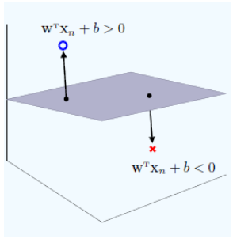

## 超平面与法向量

而d维空间中的超平面由下面的方程确定：$w^Tx+b=0$，其中,w与x都是d维列向量,x=(x1,x2,…,xd)为平面上的点, $w = (w_1,w_2,…,w_d)$为平面的法向量。b是一个实数, 代表平面与原点之间的距离.

在三维空间中, 一个平面由下面的方程确定：Ax+By+Cz+D=0，
此时$w=(A,B,C)$, $x=(x1,x2,x3)$, $b=D$,

### 点到超平面的距离

假设点x′为超平面A:$w^Tx+b=0$上的任意一点, 则点x到A的距离为x−x′在超平面法向量w上的投影长度：
$$
d=\frac{|w^T(x-x')|}{||w||}
 =\frac{|w^Tx+b|}{||w||}
 =\frac{|w^Tx+b|}{\sqrt{w_1^2+w_2^2+…+w_d^2}}
$$

### 超平面的正面与反面

一个超平面可以将它所在的空间分为两半, 它的法向量指向的那一半对应的一面是它的正面, 另一面则是它的反面。

$$
\begin{cases}
w^Tx+b>0, & \text{点x在超平面的正面} \\
w^Tx+b<0, & \text{点x在超平面的反面} \\
w^Tx+b=0, & \text{点x在超平面上}
\end{cases}
$$

若将距离公式中分子的绝对值去掉, 让它可以为正为负. 那么, 它的值正得越大, 代表点在平面的正向且与平面的距离越远. 反之, 它的值负得越大, 代表点在平面的反向且与平面的距离越远。

### 法向量的意义

法向量是是指一个与超平面正交（垂直）的向量，即它与超平面上的所有向量正交，通常用于表示超平面的方向。

在支持向量机（SVM）等算法中，法向量用于定义分类超平面：

* w 确定分类决策边界的方向。
* ||w|| 影响分类间隔的大小，间隔越大，模型的泛化能力越强。

## 二次规划问题

标准的二次规划问题可以表示为：

$$
\begin{aligned}
&\min_{x}\frac{1}{2}x^TPx+q^Tx \\
&s.t. \quad Gx\leq h \\
&\quad \quad Ax=b
\end{aligned}
$$

其中：

* x∈Rn：待优化的变量向量。
* P∈Rn×n：对称半正定矩阵，定义了目标函数的二次项。
* q∈Rn：线性项系数向量。
* G∈Rm×n,h∈Rm：线性不等式约束。
* A∈Rp×n,b∈Rp：线性等式约束。

### 二次规划问题的组成部分

#### 目标函数

目标函数是一个二次函数，由两部分组成：

$$
f(x)=\frac{1}{2}x^TPx+q^Tx
$$

* $\frac{1}{2}x^TPx$：二次项，定义了目标函数的曲率，决定函数的凸性。
* $q^Tx$：线性项，定义目标函数的偏移。

目标是最小化 f(x)。

#### 约束条件

约束条件分为两类：

* **不等式约束**：Gx≤h，表示 m 个线性不等式限制 x 的值域。
* **等式约束**：Ax=b，表示 p 个线性等式必须满足。

约束条件定义了一个可行域，目标是在该区域内找到使目标函数最小化的解。

## 支持向量机

支持向量机是一种监督学习模型，用于分类和回归问题。它通过找到一个最优的超平面（或超平面集合）来将数据分成不同的类别。SVM的核心思想是最大化分类间隔，即最大化超平面到最近数据点的距离。

### 基本概念

* **超平面**：在d维空间中，超平面是一个d-1维的子空间。在二维空间中，超平面是一条直线；在三维空间中，超平面是一个平面。
* **支持向量**：支持向量是那些最接近超平面的数据点，它们决定了超平面的位置和方向。
* **间隔**：间隔是超平面到最近数据点的距离。最大化间隔意味着找到最优的超平面，使得分类错误最小化。

### 线性支持向量机

线性支持向量机的目标是找到一个最优的超平面，使得数据点可以被正确分类，并且分类间隔最大化。

线性支持向量机的目标函数可以表示为：
$$
\min_{w,b}\frac{1}{2}||w||^2
$$

其中，$w$ 是超平面的法向量，$b$ 是超平面的截距。

对于给定的数据集T和超平面 $w^Tx+b=0$，数据点到超平面的距离可以表示为：
$$
d=\frac{|w^Tx+b|}{||w||}
$$
超平面关于所有样本点的几何间隔的最小值为
$$
\gamma=\min_{i=1,…,n}\frac{y_i(w^Tx_i+b)}{||w||}
$$

实际上这个距离就是我们所谓的 **支持向量到超平面的距离**

可以表示为以下约束最优化问题
$$
\begin{aligned}
&\min_{w,b}\gamma \\
&s.t. \quad y_i(w^Tx_i+b)\geq \gamma, \quad i=1,…,n
\end{aligned}
$$
令 $w=\frac{w}{||w||\gamma}$,$b=\frac{b}{||w||\gamma}$, 则上述问题可以转化为

$$
\begin{aligned}
&\min_{w,b}\frac{1}{2}||w||^2 \\
&s.t. \quad y_i(w^Tx_i+b)\geq 1, \quad i=1,…,n
\end{aligned}
$$

通过拉格朗日对偶性，原始问题可转换为对偶形式：

$$
\begin{aligned}
&\max_{\alpha}\sum_{i=1}^{n}\alpha_i-\frac{1}{2}\sum_{i=1}^{n}\sum_{j=1}^{n}\alpha_i\alpha_jy_iy_j(x_i^Tx_j) \\
&s.t. \quad \sum_{i=1}^{n}\alpha_iy_i=0 \\
&\quad \quad 0\leq \alpha_i\leq C, \quad i=1,…,n
\end{aligned}
$$

将其转化为标准形式：

$$
\begin{aligned}
&\min_{\alpha}\frac{1}{2}\alpha^TQ\alpha-e^T\alpha \\
&s.t. \quad A\alpha\leq b
\end{aligned}
$$

其中：

* P=K，即核矩阵，$K_{ij} = y_iy_jx_i·x_j$​。
* q=−1，长度为 m 的全 1 向量。
* G=\[I−I​],h=\[C0​]。
* A=yT,b=0。

#### 求解的意义

通过数值方法（如内点法）解出拉格朗日乘子 $\alpha$

通过 $\alpha$ 求出

$$
w=\sum_{i=1}^{n}\alpha_iy_ix_i
$$

b的值可以通过支持向量计算得到

$$
b=\frac{1}{|SV|}\sum_{​i∈SV}{​(y_i​−w⋅x_i​)}
$$
其中 SV 表示支持向量的集合，∣SV∣ 是支持向量的数量。

### 非线性支持向量机

非线性支持向量机通过引入核函数，将原始数据映射到一个高维空间，使得数据在高维空间中线性可分。核函数可以将原始数据映射到更高维度的空间，从而使得数据在高维空间中线性可分。

## 附录

* [超平面与法向量](https://www.cnblogs.com/jin-liang/p/9717651.html)
* [支持向量机模型详解|ShowMeAI](https://www.showmeai.tech/tutorials/34?articleId=196)
* [支持向量机手动实现](code://机器学习/支持向量机手动实现.ipynb)
