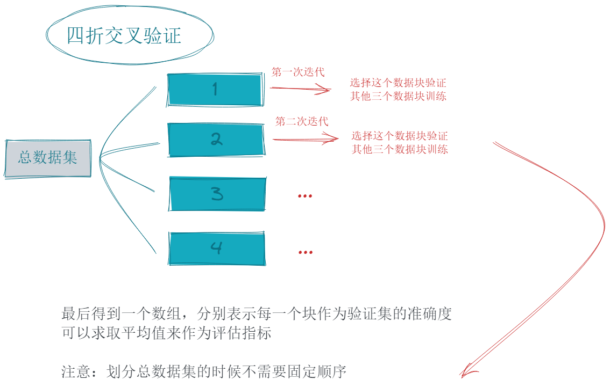
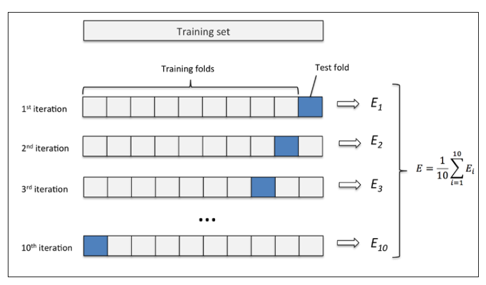

## 普通验证

就是将数据集分为训练集和测试集，训练集用于训练模型，测试集用于验证模型的准确性。

一般情况下，将数据集分为训练集和测试集的比例为`7:3`或`8:2`。

## (K折)交叉验证

k折交叉验证将数据集分为k个数据块，每次取一个数据块作为测试集，其余的作为训练集，重复k次，最后取k次的平均值。

常用的交叉验证有四折交叉验证，十折交叉验证，留一交叉验证等。

### 四折交叉验证

通过四折交叉验证的流程，可以推出k折交叉验证的流程。

### 留一交叉验证

在k折交叉验证中，当k=n时，称为留一交叉验证。  
也就是在极端情况下，将每一个样本都作为一个数据块，每次取一个样本作为测试集，其余的作为训练集。

### 视频

<iframe width="560" height="315" src="https://www.youtube.com/embed/fSytzGwwBVw?si=gT1XHctxlavZVB9H" title="YouTube video player" frameborder="0" allow="accelerometer; autoplay; clipboard-write; encrypted-media; gyroscope; picture-in-picture; web-share" referrerpolicy="strict-origin-when-cross-origin" allowfullscreen></iframe>

### 代码

[交叉验证手动实现代码](code://机器学习/交叉验证手动实现.ipynb)
