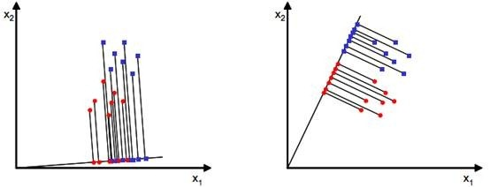

## 属性降维

属性降维是指在保持数据集信息完整性的前提下，通过消除冗余、噪声或不相关的属性，减少属性个数，提高数据集的处理效率和学习性能。简单说就是降维。

目前已经存在大量的数据降维算法，可以从另个不同的维度对它们进行分类。按照是否有使用样本的标签值，可以将降维算法分为 有监督降维 和 无监督降维 ；按照降维算法使用的映射函数，可以将算法分为 线性降维 与 非线性降维 。

### 分类

有监督降维是指在降维过程中使用了样本的标签值。有监督降维的目标是在降维的同时，保持样本的类别信息。有监督降维的代表算法是线性判别分析（LDA）。

无监督降维是指在降维过程中没有使用样本的标签值。无监督降维的目标是在降维的同时，保持数据集的内在结构。无监督降维的代表算法是主成分分析（PCA）。

### PCA主成分分析

PCA的思想是将n维特征映射到k维上（k < n），这k维是全新的正交特征。这k维特征称为主成分，是重新构造出来的k维特征，而不是简单地从n维特征中去除其余n-k维特征。

### ICA独立成分分析

与主成分分析区别：主成分分析假设源信号间彼此非相关，独立成分分析假设源信号间彼此独立。主成分分析认为主元之间彼此正交，样本呈高斯分布；独立成分分析则不要求样本呈高斯分布。

### LDA线性判别分析

| 降维方法 | 思想          | 分布         | 监督方式 | 投影                           | 维度                                    | 目的                                  |
| ---- | ----------- | ---------- | ---- | ---------------------------- | ------------------------------------- | ----------------------------------- |
| PCA  | 数据降维，矩阵特征分解 | 假设数据符合高斯分布 | 无监督  | 投影的坐标系都是正交的                  | 直接和特征维度相关，比如原始数据是d维，PCA之后，可以任意选取1～n维  | 去除原始数据集中冗余的维度，让投影子空间各个维度的方差尽可能大     |
| LDA  | 数据降维，矩阵特征分解 | 假设数据符合高斯分布 | 有监督  | 根据类别的标注关注分类能力，不保证投影到的坐标系是正交的 | 与数据本身的维度无关，和类别个数C相关，LDA之后，在1～C-1维进行选择 | 找到具有区分的维度，使得原始数据在这些维度上的投影能尽可能区分不同类别 |

## 特征选择

三种方法：过滤法（filter）、包装法（wrapper）和嵌入法（embedded）

### 过滤法

#### 方差过滤

一个特征本身的方差很小，就表示样本在这个特征上基本没有差异，可能特征中的大多数值都一样，甚至整个特征的取值都相同，那这个特征对于样本区分没有什么作用，设置阈值来控制小于阈值方差的特征被删除。

#### 相关性过滤

在 sklearn 中有三种常用的方法来评判特征和标签之间的相关性：卡方、F检验和互信息。

##### 卡方过滤

卡方过滤是专门针对离散型标签的相关性过滤。  
卡方检验类feature_selection.chi2计算每个非负特征和标签之间的卡方统计量，并依照卡方统计量由高到低为特征排名
> 卡方统计量是用于检验观察值与期望值之间差异的统计量，常用于卡方检验。

##### F检验

F检验既可以做回归也可以做分类

##### 互信息

互信息法是用来捕捉每个特征与标签之间的任意关系（包括线性和非线性关系）。  \
F检验只能够找出线性关系，而互信息法可以找出任意关系。

互信息法不返回 p 值或 F 值类似的统计量，它返回“每个特征与目标之间的互信息量的估计”，这个估计量在[0,1]之间取值，为0则表示两个变量独立，为1则表示两个变量完全相关。

### Embedding嵌入法

嵌入法就是先使用某些机器学习的算法和模型进行训练，得到各个特征的权值系数，根据系数从大到小选择特征。这种方法是直接将特征选择过程嵌入到模型训练中，和模型训练同时进行。

### Wrapper包装法

包装法也是一个特征选择和算法训练同时进行的方法，与嵌入法十分相似，它也是依赖于算法自身的选择，比如coef_属性或feature_importances_属性来完成特征选择。但不同的是，我们往往使用一个目标函数作为黑盒来帮助我们选取特征，而不是自己输入某个评估指标或统计量的阈值。包装法在初始特征集上训练评估器，并且通过coef_属性或通过feature_importances_属性获得每个特征的重要性。然后，从当前的一组特征中修剪最不重要的特征。在修剪的集合上递归地重复该过程，直到最终到达所需数量的要选择的特征。区别于过滤法和嵌入法的一次训练解决所有问题，包装法要使用特征子集进行多次训练，因此它所需要的计算成本是最高的。

## 因子分析

因子分析的起源是1904年英国的一个心理学家发现学生的英语、法语和古典语成绩非常有相关性，他认为这三门课程背后有一个共同的因素驱动，最后将这个因素定义为“语言能力”。基于这个想法，发现很多相关性很高的因素背后有共同的因子驱动，从而定义了因子分析。

因子分析就是将存在某些相关性的变量提炼为较少的几个因子，用这几个因子去表示原本的变量，也可以根据因子对变量进行分类。

举个例子。学生有语文、英语、历史、数学、物理、化学六门成绩，通过因子分析会发现这六门课由两个公共因子驱动，前三门是由“文科”因子，后三门是“理科”因子；从而可以计算每个学生的文科得分和理科得分来评估他在两个方面的表现。

## 代码

## 附录

- [机器学习算法—降维算法—PCA](https://jintang.github.io/2019/08/27/%E6%9C%BA%E5%99%A8%E5%AD%A6%E4%B9%A0%E7%AE%97%E6%B3%95%E2%80%94%E9%99%8D%E7%BB%B4%E7%AE%97%E6%B3%95%E2%80%94PCA/)
- [线性特征降维——ICA](https://leoncuhk.gitbooks.io/feature-engineering/content/feature-extracting04.html)

- [机器学习之特征选择](https://www.cnblogs.com/s1awwhy/p/14067489.html)
