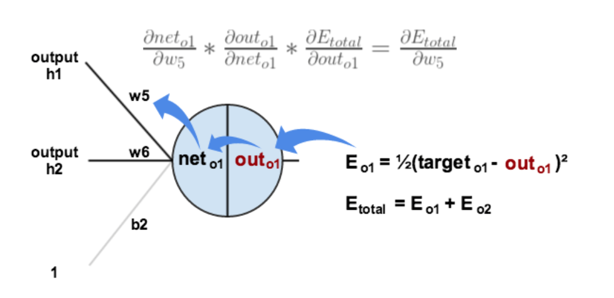

## 感知机

感知机就是模拟神经元从接收输入信号传递输出信号的过程，如果加权和超过了一个阈值，神经元激活，输出信号；否则神经元不激活，不输出信号。感知机接收输入信号，通过加权和激活函数输出信号。

## 损失函数

损失函数用来衡量模型预测结果与真实值之间的差距。值越小，说明模型的预测越准确；值越大，说明预测越不准确。

## 梯度下降

梯度下降是一种优化算法，用来最小化损失函数。

梯度下降通过计算损失函数的梯度，沿着梯度的反方向（即损失下降最快的方向）更新参数，逐步逼近损失函数的最小值。

## 激活函数

激活函数会决定一个神经元的输出是否传递给下一层。如果输出值很大，神经元就“激活”；如果输出值很小，神经元就“抑制”。

激活函数（Activation Function）是神经网络中的一个重要组成部分。它的作用是为神经网络引入**非线性**，使得神经网络能够学习复杂的模式和关系。如果没有激活函数，神经网络就只是一个线性模型，无论有多少层，都只能解决简单的线性问题。

---

### **通俗解释**

想象你在玩一个游戏，任务是判断一张图片是猫还是狗。你的大脑会通过一系列的“判断”来完成这个任务：

1. 图片中有耳朵吗？
2. 耳朵是尖的还是圆的？
3. 图片中有尾巴吗？
4. 尾巴是长的还是短的？

这些“判断”就是神经网络的“神经元”在做的事情。而激活函数的作用就是决定这些“判断”是否足够强，是否需要传递给下一层。

- **如果没有激活函数**：神经网络的每一层只能做简单的线性计算，就像你只能回答“是”或“不是”，无法处理复杂的判断。
- **有了激活函数**：神经网络可以学习更复杂的规则，比如“如果耳朵是尖的，而且尾巴是长的，那么可能是猫”。

## 前向传播

前向传播就是根据输入数据和权重，通过激活函数，计算网络的输出。

## 反向传播

反向传播就是根据前向传播后的结果与真实值之间的误差，通过链式法则，更新权重。

其中net是神经元的输入，out是神经元的输出,net是加权后的结果，out是激活函数后的结果。

## 正则化

正则化就像“适度复习”，帮助模型在训练时不过度依赖训练数据，从而提升泛化能力。

### L1正则化

L1正则化在损失函数中添加模型参数的绝对值之和作为惩罚项。

$$
 \text{损失函数} = \text{原始损失函数} + \lambda \sum_{i=1}^{n} |w_i|
$$

- $w_i$ 是模型的参数。
- $\lambda$ 是正则化强度。

#### 特点

- 稀疏性：L1正则化倾向于将一些参数压缩到0，适合特征选择。
- 鲁棒性：对异常值不敏感。

### L2正则化

L2正则化在损失函数中添加模型参数的平方和作为惩罚项。

$$
 \text{损失函数} = \text{原始损失函数} + \lambda \sum_{i=1}^{n} w_i^2
 $$

- $w_i$ 是模型的参数。
- $\lambda$ 是正则化强度。

#### 特点

- 平滑性：L2正则化让参数接近0但不为0，适合处理共线性问题。
- 稳定性：对异常值敏感。

## 附录

[一文弄懂神经网络中的反向传播法——BackPropagation](https://www.cnblogs.com/charlotte77/p/5629865.html)
