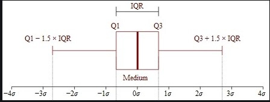

### 什么是 Inliers 和 Outliers？

Outliers（异常值）是看起来与给定数据集中的大多数其他值有很大差异的值。异常值通常可能是由于新发明（真正的异常值）、新模式/现象的发展、实验错误、很少发生的事件、异常、由于排版错误导致的错误输入数据、数据记录系统/组件故障等而出现的。
Inliers（正常值）是除异常值之外的分布中的所有数据点。

### 异常值的识别

*全局或点异常值*： 偏离分布的单个值/数据点，大多数异常值检测方法通常旨在检测点/全局异常值。

*集合异常值*：当一组数据点偏离分布时，称为集合异常值。根据特定领域来解释它们的相关性是完全主观的。此外，集合异常值表明新现象或发展的形成。

*上下文异常值*：这些是基于对其相关性的解释的特定条件，例如语音识别技术中的单一背景噪声。

## 识别方法

### 四分位间距(IQR)

四分位点内距（Inter-Quartile Range，IQR），是指在第 75 个百分点与第 25 个百分点的差值，或者说，上、下四分位数之间的差，计算 IQR 的公式是：

> IQR = Q3 − Q1

> outliers = value < ( Q1 - 1.5 \* IQR ) or value > ( Q3 + 1.5 \* IQR )

这种探测离群点的方法，是箱线图默认的方法，箱线图提供了识别异常值离群点的一个标准：

异常值通常被定义为小于 QL - l.5 IQR 或者 大于 Qu + 1.5 IQR 的值，QL 称为下四分位数， Qu 称为上四分位数，IQR 称为四分位数间距，是 Qu 上四分位数和 QL 下四分位数之差，其间包括了全部观察值的一半。

箱线图的各个组成部分的名称及其位置如下图所示：

箱线图可以直观地看出数据集的以下重要特性：

中心位置：中位数所在的位置就是数据集的中心，从中心位置向上或向下看，可以看出数据的倾斜程度。
散布程度：箱线图分为多个区间，区间较短时，表示落在该区间的点较集中；
对称性：如果中位数位于箱子的中间位置，那么数据分布较为对称；如果极值离中位数的距离较大，那么表示数据分布倾斜。
离群点：离群点分布在箱线图的上下边缘之外。

### 参考文章

[使用 IQR、Z 分数、LOF 和 DBSCAN 检测异常值](https://www.kuxai.com/article/622)
